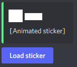

# W2D (Whatsapp to Discord)

Use Whatsapp through Discord.

---

## Features

### **Channels**

- Qrcode receiving
- Audio Editing (add zap.mp3 sound at the end of the audio)
- Record audios


- Chats


### **Receiving / Sending**

You can receive more things than you can send at the moment.
You only can send texts, images and audios.

- Receive Text


- Receive replies


- Receive Image


- Receive Audio


- Receive Video


- Receive Document


- Receive Location


- Receive Sticker




- Receive Gif


---

## Before Usage

- Create an application and a bot on discord developer website.
- Create an server for you (and **ONLY YOU!!!**).
- Add the bot to the server with scopes `bot` and `applications.commands` and with bot permissions `Administrator`.
- Get the discord bot token and client id.

---

## Usage (non-development)

- Firstly, do the the things of `Before Usage` section.
- Clone this project.
- Install docker if you havent.
- Run `docker build -t w2d .` to build the image.
- Run the following command to start the bot:

Replace the discord tokens and client ids<br>
Replace the path to the state, I recommend to put the absolute path of project root + "/state" (eg.: Project path: "/usr/w2d", State: "/usr/w2d/state")

```
docker run --rm -it -e DISCORD_BOT_TOKEN={YOUR_BOT_TOKEN} -e DISCORD_BOT_CLIENT_ID={YOUR_BOT_CLIENT_ID} -e WA_EXECUTABLE_PATH="/usr/bin/chromium-browser" -e WA_HEADLESS=true -v {PATH_TO_SAVE_STATE}:/app/state w2d
```

- Now, go to the discord server and scan the qrcode.

Every time you run the command you will need to scan the code again because of an integrity check fail problem.

---

## Usage (development)

- Firstly, do the the things of `Before Usage` section.
- Ensure that your node version is **16.6.0** or newer with 
- Install image magick and(for windows users) add to the environment path vars.
- Install ffmpeg and(for windows users) add to the environment path vars.
- Create a `.env` file on the project root and write the following:
```
DISCORD_BOT_TOKEN={YOUR_BOT_TOKEN}
DISCORD_BOT_CLIENT_ID={YOUR_BOT_CLIENT_ID}
```
- Run `npm i` to install dependencies.
- Run the bot with `npm run dev`, scan the qr code and enjoy.

---

## Problems

- For some reasong when I enable the headless mode sometimes the integrity check doesnt work. Then, by default, its disabled, if you want to enable go to `whatsapp.ts` file on `src/bots` dir and change what you want. I think it is happening because multi device support is very recent.

---

## Contributing

- Fork it, do what you want and request the merge.

---

## I'm responsible for any damage?

**NO**, use at **your** risk!
